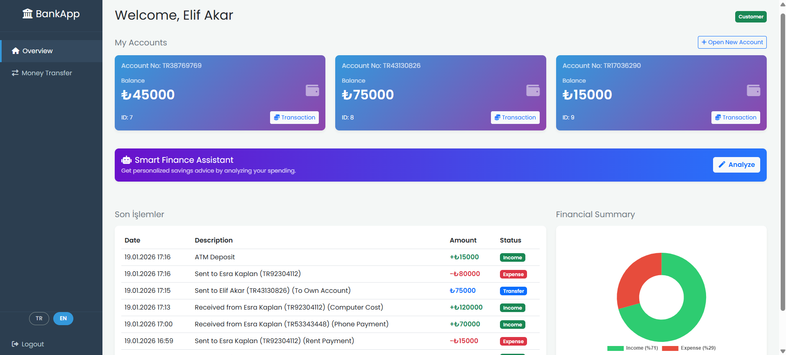
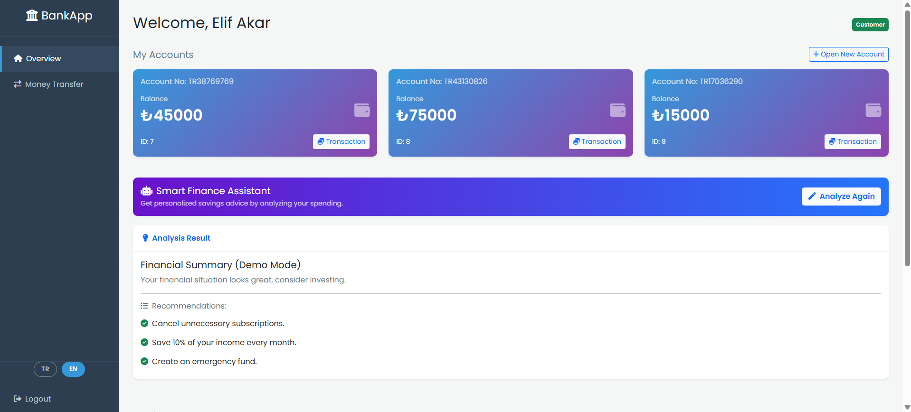
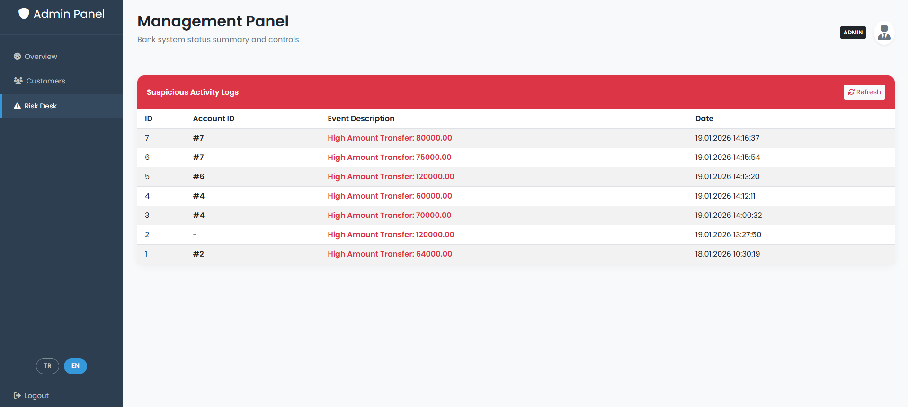
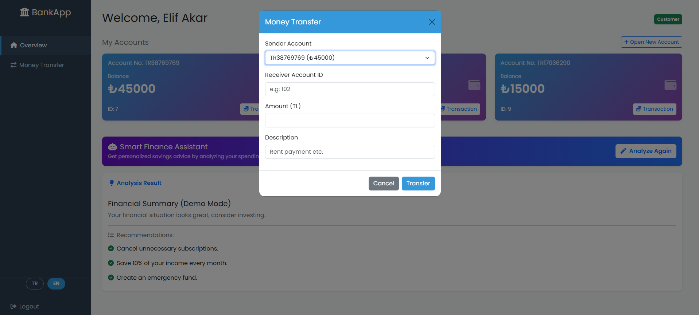
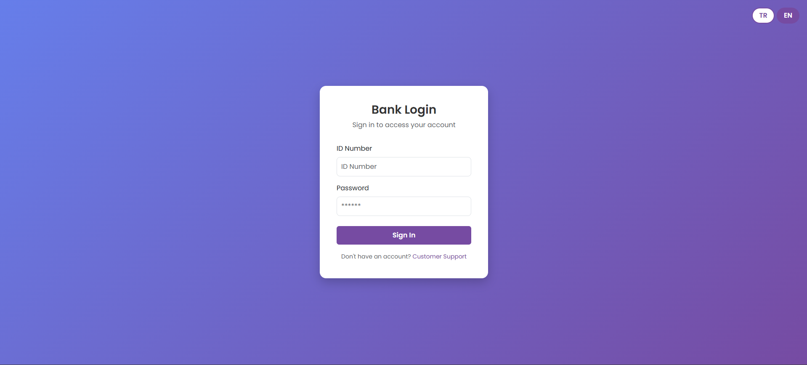
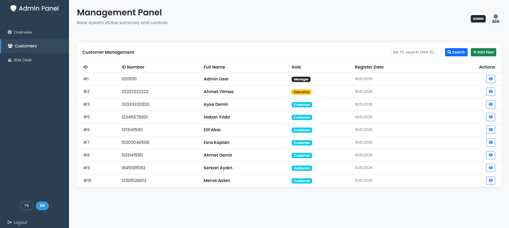

# 🏦 BankBackend - Next-Gen Financial API Ecosystem

[](README.md) [](README.tr.md)
[](LICENSE)

   

**BankBackend** is a high-performance, secure, and scalable Backend project developed with **.NET 8** technology to meet modern banking needs. Designed adhering to **Clean Architecture** principles, this project features advanced capabilities such as **AI-Powered** financial advisory, **Redis** caching, and **Real-Time Risk Analysis**.

> **🎯 Motivation:** This project was built to simulate a real-world banking environment, moving beyond simple CRUD operations to implement advanced concepts like **Concurrency Handling (Transactions)**, **AI Integration**, and **Containerization**.

---

## 📸 Screenshots

### 🌟 Dashboard Preview

*(Save your best screenshot as `assets/en/main_dashboard.png`)*

<details>
<summary>📂 <b>Click to view more screenshots (Gallery)</b></summary>

| Admin Panel | AI Advisor | Risk Management |
| :---: | :---: | :---: |
|  |  |  |
| *Admin Controls* | *AI Suggestions* | *Risk Analysis* |

| Transfer Screen | Login | Swagger UI |
| :---: | :---: | :---: |
|  |  |  |

| Account Management | | |
| :---: | :---: | :---: |
|  | | |
| *Account Details* | | |

</details>

---

## 🚀 Installation & Running

We offer two ways to run the project:

### Option 1: Full Docker Mode (Recommended for Demo)
Launch the entire system (API + DB + Redis) with a single command. No local .NET SDK required.

```bash
docker-compose up -d --build
```
*   **API:** `http://localhost:8080`
*   **Swagger:** `http://localhost:8080/swagger`
*   **Dashboard:** `http://localhost:8080` (Login required)

### Option 2: Hybrid Developer Mode
Develop your code in **Visual Studio** while running Database and Redis in **Docker**.

1.  **Start Infrastructure:**
    ```bash
    docker-compose -f docker-compose.dev.yml up -d
    ```
    *This starts PostgreSQL (Port: 5433) and Redis (Port: 6379).*

2.  **Run Project:**
    Open `BankBackend.sln` in Visual Studio and press **F5**.
    *The project is pre-configured to connect to the Docker database.*

---

### 🔑 Login Credentials

| Role | ID Number (TC) | Password | Permissions |
| :--- | :--- | :--- | :--- |
| **Admin** | `99999999999` | `admin123` | View all customers, Risk Desk, Statistics |
| **Customer** | `12345678901` | `123456` | Money transfer, Open account, AI Analysis |

---

## 🔥 Project Features & Technical Depth

This project demonstrates proficiency in the following advanced areas:

### 1. 🧠 AI-Powered Financial Advisor
*   **Technology:** Microsoft Semantic Kernel (LLM Integration).
*   **Function:** Analyzes transaction history to provide personalized financial advice.
*   **Innovation:** Includes a **"Mock Mode"** that simulates AI responses without API keys/costs for development, and seamlessly switches to **OpenAI** for production.

### 2. ⚡ High-Performance Caching (Redis)
*   **Technology:** Redis & StackExchange.Redis.
*   **Pattern:** **Cache-Aside Pattern**.
*   **Benefit:** Reduces database load by ~80% for frequently accessed data (e.g., User Profiles), delivering response times in **milliseconds**.

### 3. 🛡️ Database Triggers & Risk Management
*   **Technology:** PostgreSQL PL/pgSQL.
*   **Function:** Automated security at the database level.
*   **Scenario:** Any transfer > 50,000 TL triggers a **Stored Procedure**, logging a "HIGH_AMOUNT_TRANSFER" alert in the `risk_masasi` table for admin review.

### 4. 🏗️ Clean Architecture & SOLID
*   **Structure:** Separation of Concerns (`Controllers` -> `Services` -> `Repositories` -> `Database`).
*   **Benefit:** Highly testable and maintainable codebase.

### 5. 🔐 Security (JWT & Hashing)
*   **Authentication:** Secure stateless authentication using **JWT (JSON Web Token)**.
*   **Authorization:** Role-Based Access Control (RBAC) middleware.
*   **Data Protection:** Passwords are hashed using strong cryptographic algorithms before storage.

### 6. 🐳 DevOps & CI/CD
*   **Docker:** Full containerization of the App, Database, and Redis.
*   **GitHub Actions:** Automated build and test pipeline on every push to ensure code quality.

---

## 🛠️ Tech Stack

*   **Backend:** .NET 8, C#
*   **Database:** PostgreSQL 15
*   **ORM:** Entity Framework Core (Code-First)
*   **Cache:** Redis
*   **AI:** Microsoft Semantic Kernel
*   **Testing:** xUnit, FluentValidation
*   **Logging:** Serilog, Seq
*   **Container:** Docker
*   **Frontend:** HTML5, Bootstrap 5, Chart.js

---

## 📂 Project Structure

```bash
BankBackend/
├── Controllers/       # API Endpoints (REST)
├── Services/          # Business Logic (The "Brain")
├── Interfaces/        # Abstractions (Dependency Injection)
├── Data/              # EF Core Context & Migrations
├── DTOs/              # Data Transfer Objects (Security)
├── Middleware/        # Global Exception Handling
└── wwwroot/           # Dashboard UI Files
```

---

## 🧪 Tests

The project includes **Unit Tests** to verify business logic and service layers.

```bash
dotnet test
```

---
*Developed by Mertcanhirlak - 2026*
