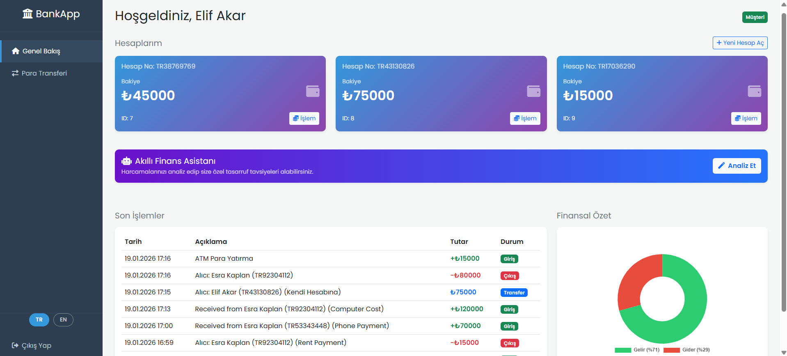
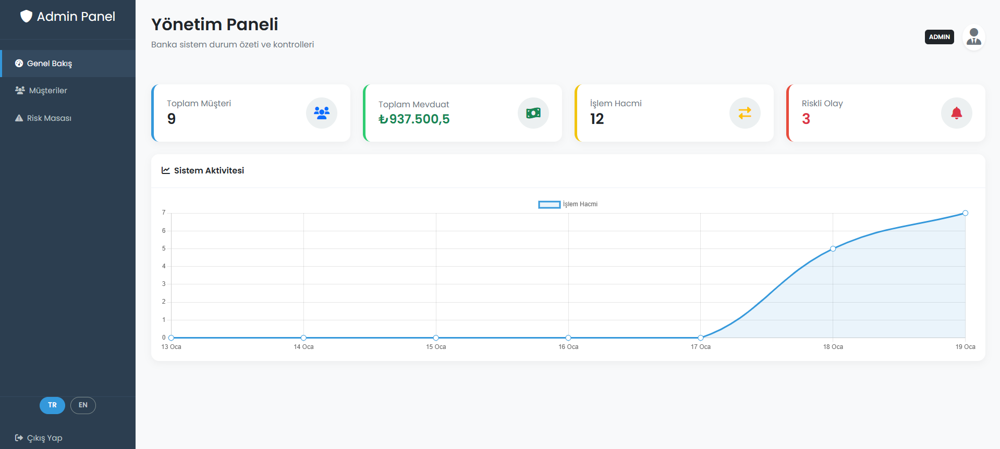
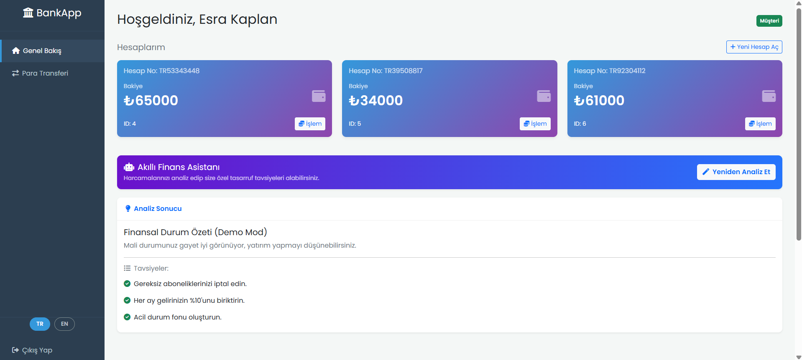
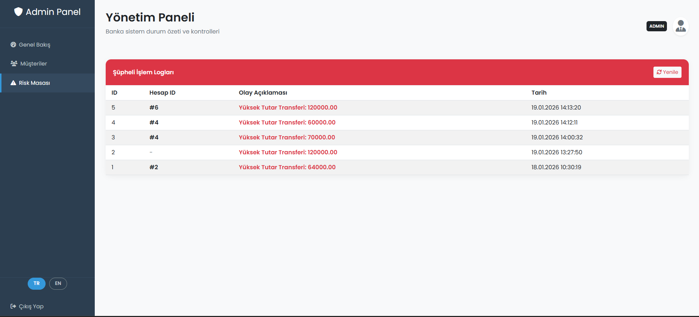
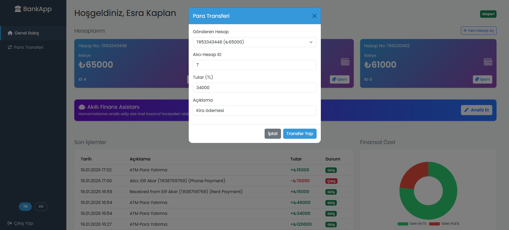
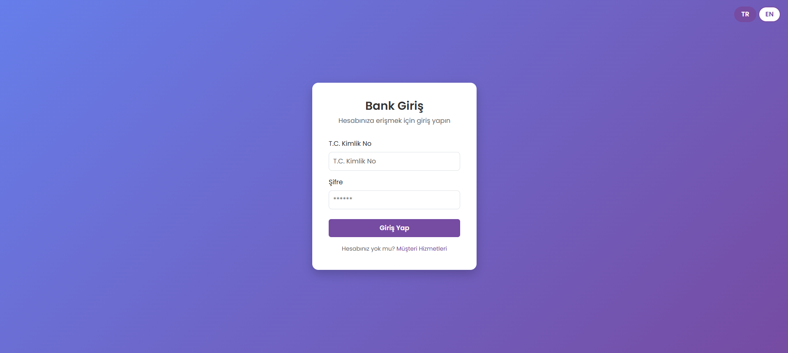
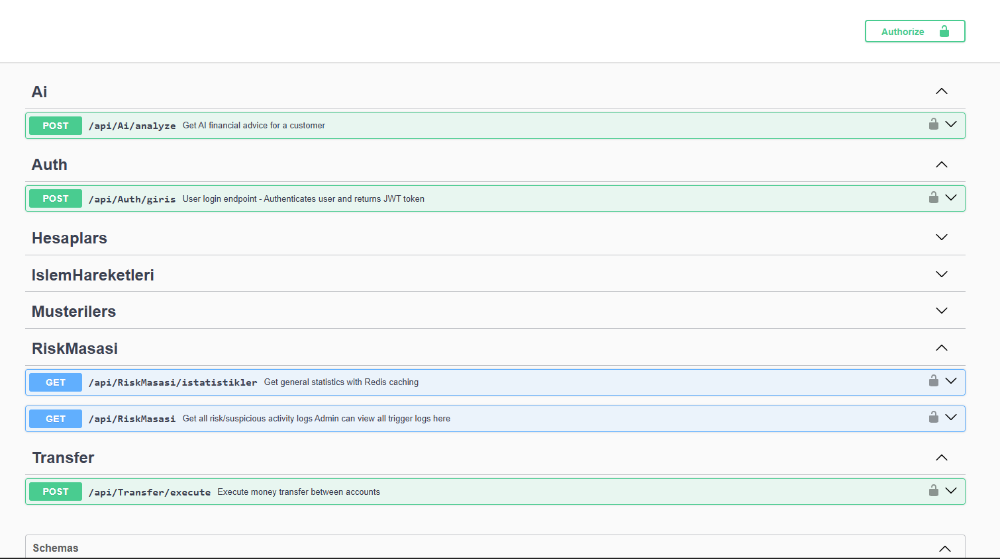
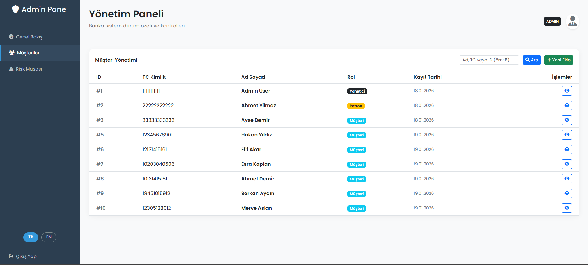

# 🏦 BankBackend - Next-Gen Finansal API Ekosistemi

[](README.md) [](README.tr.md)
[](LICENSE)

   

**BankBackend**, modern bankacılık ihtiyaçlarını karşılamak üzere **.NET 8** teknolojisi ile geliştirilmiş, yüksek performanslı, güvenli ve ölçeklenebilir bir Backend projesidir. **Clean Architecture** prensiplerine sadık kalınarak tasarlanan bu proje; **Yapay Zeka (AI)** destekli finansal danışmanlık, **Redis** önbellekleme ve **Gerçek Zamanlı Risk Analizi** gibi ileri seviye özellikleri barındırır.

> **🎯 Motivasyon:** Bu proje, basit CRUD işlemlerinin ötesine geçerek; **Transaction Yönetimi**, **AI Entegrasyonu** ve **Konteynerizasyon** gibi gerçek dünya senaryolarını simüle etmek ve modern yazılım mimarilerini uygulamak amacıyla geliştirilmiştir.

---

## 📸 Ekran Görüntüleri

### 🌟 Ana Panel (Dashboard)

*(En iyi görselinizi `assets/tr/main_dashboard.png` adıyla kaydedin)*

<details>
<summary>📂 <b>Diğer ekran görüntülerini görmek için tıklayın (Galeri)</b></summary>

| Yönetici Paneli | AI Danışman | Risk Yönetimi |
| :---: | :---: | :---: |
|  |  |  |
| *Yönetici Kontrolleri* | *AI Tavsiyeleri* | *Risk Analizi* |

| Transfer Ekranı | Giriş Ekranı | Swagger UI |
| :---: | :---: | :---: |
|  |  |  |

| Hesap Yönetimi | | |
| :---: | :---: | :---: |
|  | | |
| *Hesap Detayları* | | |

</details>

---

## 🚀 Kurulum ve Çalıştırma

Projeyi çalıştırmak için iki farklı yöntem sunuyoruz:

### Seçenek 1: Tam Docker Modu (Önerilen - Hızlı Deneme)
Hiçbir şey kurmanıza gerek kalmadan tüm sistemi (API + DB + Redis) tek komutla ayağa kaldırın.

```bash
docker-compose up -d --build
```
*   **API:** `http://localhost:8080`
*   **Swagger:** `http://localhost:8080/swagger`
*   **Dashboard:** `http://localhost:8080` (Giriş Gerekli)

### Seçenek 2: Hibrit Geliştirici Modu (Development)
Kodunuzu **Visual Studio** üzerinde geliştirirken, Veritabanı ve Redis'i **Docker** üzerinde çalıştırın.

1.  **Altyapıyı Başlatın:**
    ```bash
    docker-compose -f docker-compose.dev.yml up -d
    ```
    *Bu komut PostgreSQL'i (Port: 5433) ve Redis'i (Port: 6379) başlatır.*

2.  **Projeyi Çalıştırın:**
    Visual Studio'da `BankBackend.sln` dosyasını açın ve **F5** tuşuna basın.
    *Proje otomatik olarak Docker'daki veritabanına bağlanacak şekilde yapılandırılmıştır.*

---

### 🔑 Giriş Bilgileri

| Rol | T.C. Kimlik No | Şifre | Yetkiler |
| :--- | :--- | :--- | :--- |
| **Yönetici (Admin)** | `99999999999` | `admin123` | Tüm müşterileri görme, Risk Masası, İstatistikler, Müşteri Yönetimi |
| **Müşteri** | `12345678901` | `123456` | Para transferi, Hesap açma, AI Analizi |

---

## 🔥 Proje Özellikleri ve Teknik Derinlik

Bu proje, aşağıdaki ileri düzey konularda yetkinliği gösterir:

### 1. 🧠 Yapay Zeka (AI) Destekli Finansal Danışman
*   **Teknoloji:** Microsoft Semantic Kernel (LLM Entegrasyonu).
*   **Fonksiyon:** Hesap hareketlerini analiz ederek kişiye özel yatırım tavsiyesi verir.
*   **İnovasyon:** Maliyet oluşturmaması için **"Mock Mode"** içerir, prodüksiyon ortamında ise **OpenAI** moduna geçer.

### 2. ⚡ Yüksek Performanslı Caching (Redis)
*   **Teknoloji:** Redis & StackExchange.Redis.
*   **Desen:** **Cache-Aside Pattern**.
*   **Fayda:** Sık erişilen verileri (Profil vb.) RAM üzerinde tutarak veritabanı yükünü %80 azaltır ve yanıt süresini **milisaniyelere** düşürür.

### 3. 🛡️ Database Trigger ile Risk Yönetimi
*   **Teknoloji:** PostgreSQL PL/pgSQL.
*   **Fonksiyon:** Veritabanı seviyesinde otomatik güvenlik.
*   **Senaryo:** 50.000 TL üzeri her transfer **Trigger** tarafından yakalanır ve yönetici incelemesi için `risk_masasi` tablosuna loglanır.

### 4. 🏗️ Clean Architecture & SOLID
*   **Yapı:** Katmanlı mimari (`Controllers` -> `Services` -> `Repositories` -> `Database`).
*   **Fayda:** Test edilebilir, sürdürülebilir ve modüler kod yapısı.

### 5. 🔐 Güvenlik (JWT & Hashing)
*   **Authentication:** **JWT (JSON Web Token)** ile güvenli ve "stateless" oturum yönetimi.
*   **Authorization:** Rol tabanlı erişim kontrolü (RBAC Middleware).
*   **Veri Koruma:** Şifreler güçlü algoritmalarla hashlenerek saklanır.

### 6. 🐳 DevOps & Otomasyon
*   **Docker:** Uygulama, Veritabanı ve Redis'in tam konteynerizasyonu.
*   **GitHub Actions:** Kod kalitesini korumak için otomatik Build ve Test süreçleri (CI/CD).

---

## 🛠️ Teknoloji Yığını (Tech Stack)

*   **Backend:** .NET 8, C#
*   **Veritabanı:** PostgreSQL 15
*   **ORM:** Entity Framework Core (Code-First)
*   **Cache:** Redis
*   **AI:** Microsoft Semantic Kernel
*   **Testing:** xUnit, FluentValidation
*   **Logging:** Serilog, Seq
*   **Container:** Docker
*   **Frontend:** HTML5, Bootstrap 5, Chart.js

---

## 📂 Proje Yapısı

```bash
BankBackend/
├── Controllers/       # API Uç Noktaları (REST)
├── Services/          # İş Mantığı ("Beyin" kısmı)
├── Interfaces/        # Bağımlılık Soyutlamaları
├── Data/              # EF Core Context & Migration
├── DTOs/              # Veri Transfer Objeleri (Güvenlik)
├── Middleware/        # Hata Yönetimi
└── wwwroot/           # Dashboard Arayüz Dosyaları
```

---

## 🧪 Testler

Proje, iş mantığını doğrulamak için **Birim Testleri (Unit Tests)** içerir.

```bash
dotnet test
```

---
*Geliştirici: Mertcanhirlak - 2026*